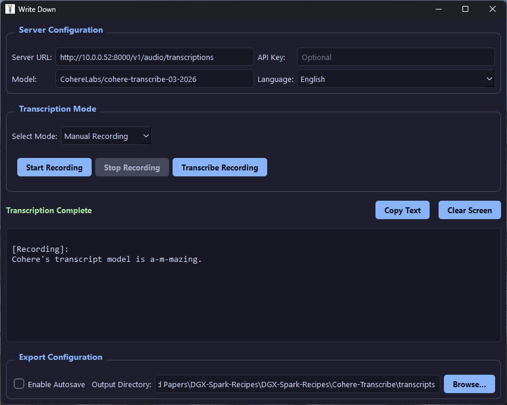

# Cohere Transcribe on DGX Spark

This repository contains deployment recipes and tools for spinning up the [Cohere Transcribe Model](https://huggingface.co/blog/CohereLabs/cohere-transcribe-03-2026-release) model locally using vLLM on your DGX Spark!

> **Note**: The model weights could not be pre-packaged directly into the base Docker image because it is a gated model on Hugging Face. You must authenticate with an access token first to download it.

## Server Deployment Steps
Follow these steps strictly to successfully deploy the Dockerized vLLM Server locally:

### Step 1: Pull the proper Docker Image
```bash
docker pull knamdar/cohere-transcribe
```

### Step 2: Boot Temporary Interactive Docker Env
```bash
docker run -it --gpus all \
  --name cohere-vllm \
  --ipc=host \
  -p 8000:8000 \
  --entrypoint /bin/bash \
  knamdar/cohere-transcribe
```

### Step 3: Login to Hugging Face
Provide your required HF access token when prompted!
```bash
hf auth login
```

### Step 4: Validate VLLM Endpoint & Load Remote Code
Inside the shell, verify you can trigger the endpoint manually.
```bash
vllm serve CohereLabs/cohere-transcribe-03-2026 --trust-remote-code
```

### Step 5: Commit Image 
In a separate terminal, commit the successfully cached model state and parameters into a standalone image.
```bash
docker commit cohere-vllm knamdar/cohere-transcribe-model-loaded
```

### Step 6: Launch Dedicated Server
Delete your sandbox setup and stand up the production instance permanently!
```bash
docker rm -f cohere-vllm 2>/dev/null

docker run -it --gpus all \
  --name cohere-vllm \
  --ipc=host \
  --shm-size=16g \
  -p 8000:8000 \
  -v hf-cache:/root/.cache/huggingface \
  --entrypoint python3 \
  knamdar/cohere-transcribe-model-loaded:latest \
  -m vllm.entrypoints.openai.api_server \
  --model CohereLabs/cohere-transcribe-03-2026 \
  --trust-remote-code
```
> **Note**: You can choose to enforce a vLLM authorization token when launching this container. If applied, you MUST pair it as the `API Key` when utilizing the Write Down app!

---

# WriteDown Application


**WriteDown** is a custom desktop GUI client built directly in this repository using PySide6. It is heavily streamlined specifically for transcribing effectively against this local vLLM Cohere endpoint seamlessly from your local desktop! 



### Key Features
*   **Realtime Microphone Streaming**: Performs sliding-window audio buffering across background threads to spit out transcript blocks practically in real-time, eliminating manual upload hassle!
*   **Transcription Recording Engine**: Manually grab a customized microphone duration and batch upload it on your mark. 
*   **File Interfacing**: Interactively grab `.wav`, `.mp3`, `.flac`, or `.m4a` files directly from your system to batch-parse massive audio tracks.
*   **Export Pipeline**: Activate "Enable Autosave" to organically timestamp outputs uniquely and dump strings autonomously onto a target directory without any data loss.

### Getting Started

Install the required framework dependencies configured inside `WriteDown_app` explicitly:

```bash
cd WriteDown_app
pip install -r requirements.txt
python WriteDown.py
```
